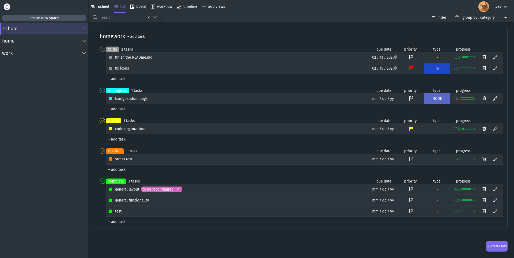

# to do list web application nodejs ( clickup for reference )
no live demo at the moment
built with Nodejs, EJS templating engine, Express, MongoDB, TailwindCSS
/

some features are unfinished and some unknown bugs
progress : ![80%]https://progress-bar.dev/<80>

## features
- autherntication
- create workspaces, lists, and tasks and sub tasks
- create tags categories and types
- set priority, due dates and progress


## ascreenshots


## insallation
install node modules
```
npm install
```
build the tailwind file 
```
npm run build_css
```
start the application
```
nodemon app
```